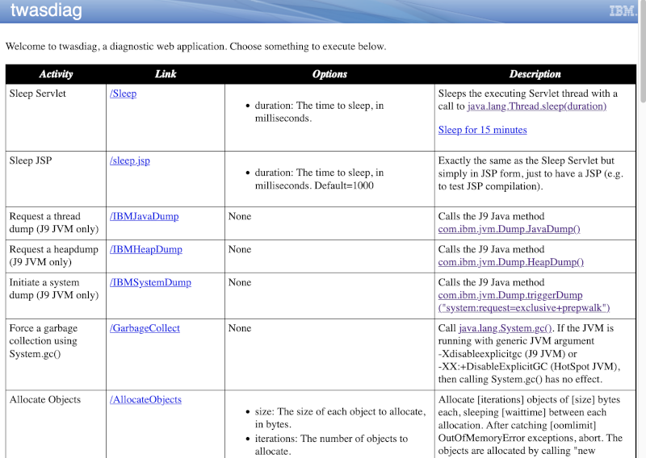

# twasdiag

`twasdiag` is a Java Enterprise Edition 6 web application for executing diagnostics. It was originally designed for [IBM WebSphere Application Server traditional](https://www.ibm.com/docs/en/was-nd/9.0.5) though it may also be used with [IBM WebSphere Liberty](https://www.ibm.com/docs/en/was-liberty/core) with the `javaee-6.0` or `javaee-7.0` features.

Running this application in production should be done with care because it may be used to execute various powerful functions.

## Download

Download `twasdiag.ear` (or `twasdiag.war`) from <https://github.com/IBM/twasdiag/releases/latest>

## Screenshot



## Development

1. Java >= 8 is required on your `PATH`; for example, [IBM Semeru Runtimes](https://developer.ibm.com/languages/java/semeru-runtimes/downloads/)
1. Build:
    * macOS and Linux:
      ```
      ./mvnw clean install
      ```
    * Windows:
      ```
      mvnw clean install
      ```
1. Run:
    * macOS and Linux:
      ```
      ./mvnw -pl ':twasdiag-ear' liberty:run
      ```
    * Windows:
      ```
      mvnw -pl ':twasdiag-ear' liberty:run
      ```
1. Wait for the message, "server is ready to run a smarter planet". For example:
   ```
   CWWKF0011I: The twasdiagServer server is ready to run a smarter planet.
   ```
1. Open your browser to the HTTP or HTTPS page:
    * <http://localhost:9080/twasdiag/>
    * <https://localhost:9443/twasdiag/>
1. When you want to stop the server, use `Ctrl^C`.
